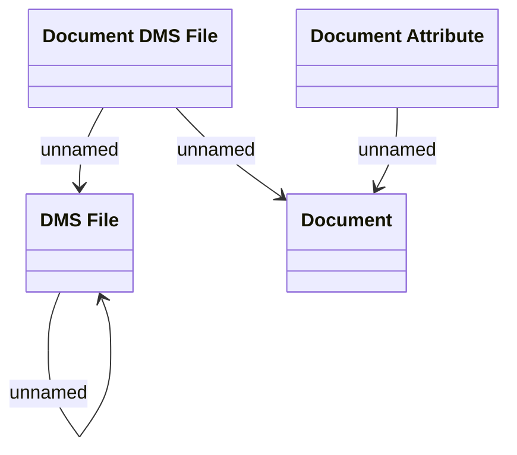

# Document Instace - Logical Data Model

```mermaid
classDiagram
    class Document_DMS_File["Document DMS File"]
    class DMS_File["DMS File"]
    class Document_Attribute["Document Attribute"]
    class Document["Document"]
    Document_Attribute --> Document : unnamed
    DMS_File --> DMS_File : unnamed
    Document_DMS_File --> DMS_File : unnamed
    Document_DMS_File --> Document : unnamed
```
