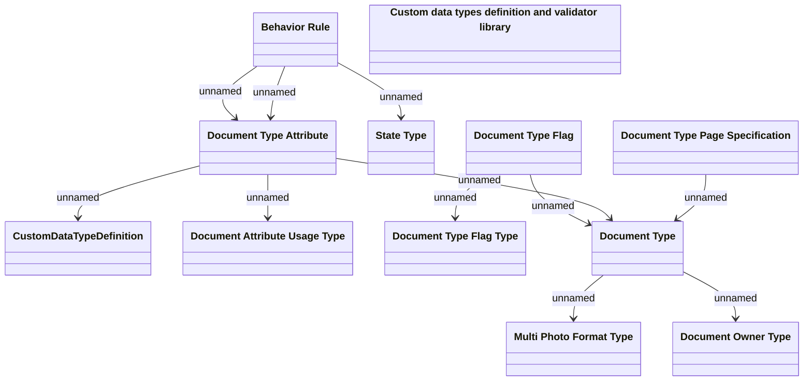

# Document Type - Logical Data Model

```mermaid
classDiagram
    class CustomDataTypeDefinition["CustomDataTypeDefinition"]
    class Document_Type_Page_Specification["Document Type Page Specification"]
    class State_Type["State Type"]
    class Behavior_Rule["Behavior Rule"]
    class Document_Attribute_Usage_Type["Document Attribute Usage Type"]
    class Document_Type_Attribute["Document Type Attribute"]
    class Document_Owner_Type["Document Owner Type"]
    class Document_Type_Flag_Type["Document Type Flag Type"]
    class Multi_Photo_Format_Type["Multi Photo Format Type"]
    class Document_Type_Flag["Document Type Flag"]
    class Document_Type["Document Type"]
    class Custom_data_types_definition_and_validator_library["Custom data types definition and validator library"]
    Document_Type --> Multi_Photo_Format_Type : unnamed
    Document_Type --> Document_Owner_Type : unnamed
    Document_Type_Flag --> Document_Type : unnamed
    Document_Type_Flag --> Document_Type_Flag_Type : unnamed
    Document_Type_Attribute --> Document_Type : unnamed
    Document_Type_Attribute --> Document_Attribute_Usage_Type : unnamed
    Document_Type_Attribute --> CustomDataTypeDefinition : unnamed
    Behavior_Rule --> State_Type : unnamed
    Behavior_Rule --> Document_Type_Attribute : unnamed
    Behavior_Rule --> Document_Type_Attribute : unnamed
    Document_Type_Page_Specification --> Document_Type : unnamed
```
