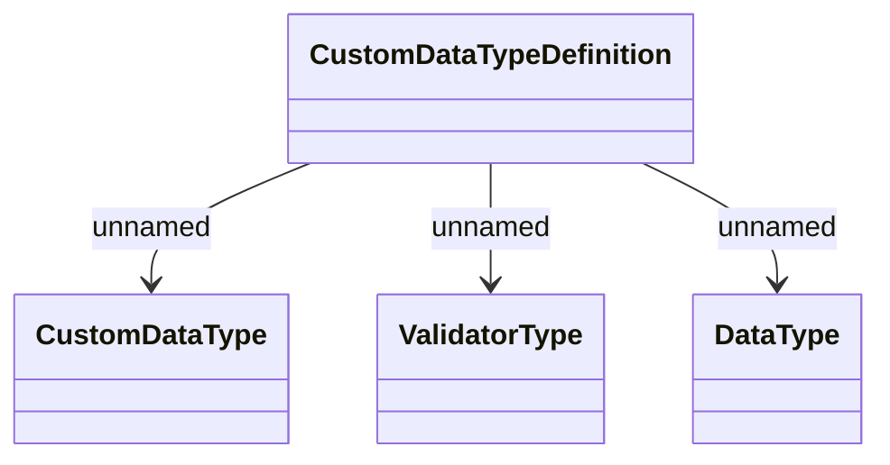

# Custom Data Type - Logical Data Model

```mermaid
classDiagram
    class ValidatorType["ValidatorType"]
    class DataType["DataType"]
    class CustomDataType["CustomDataType"]
    class CustomDataTypeDefinition["CustomDataTypeDefinition"]
    CustomDataTypeDefinition --> CustomDataType : unnamed
    CustomDataTypeDefinition --> ValidatorType : unnamed
    CustomDataTypeDefinition --> DataType : unnamed
```
