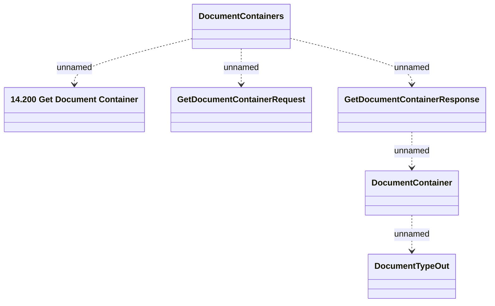

# GetDocumentContainer

- **Diagram Type**: Logical
- **Package**: HomerSelect/BSL/Modules/Document management (DMS_NG)/Interface Provided/Web Service/Document Container Services
- **Diagram ID**: 162104
- **Elements**: 6
- **Connectors**: 5

