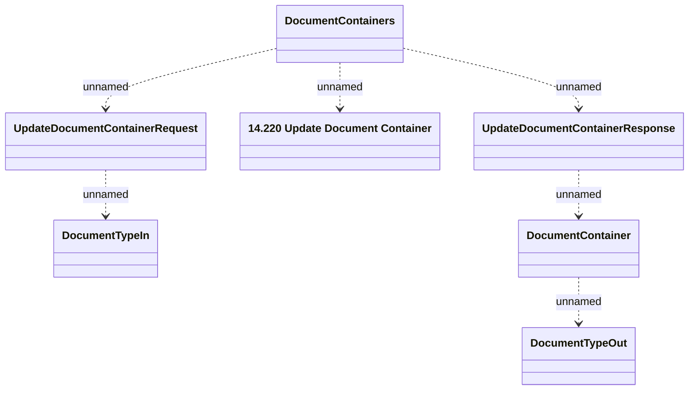

# UpdateDocumentContainer

- **Diagram Type**: Logical
- **Package**: HomerSelect/BSL/Modules/Document management (DMS_NG)/Interface Provided/Web Service/Document Container Services
- **Diagram ID**: 162106
- **Elements**: 7
- **Connectors**: 6

