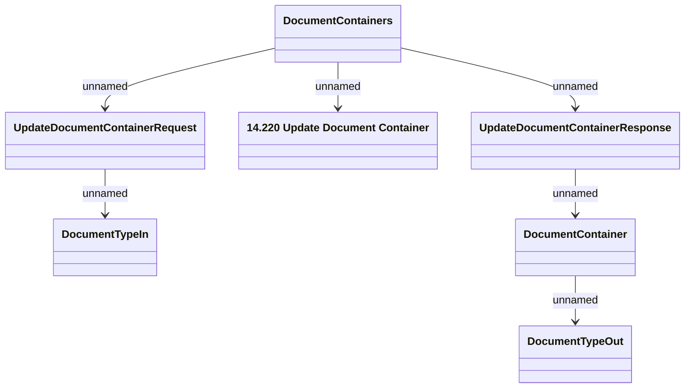

# UpdateDocumentContainer

```mermaid
classDiagram
    class DocumentTypeIn["DocumentTypeIn"]
    class DocumentTypeOut["DocumentTypeOut"]
    class DocumentContainer["DocumentContainer"]
    class DocumentContainers["DocumentContainers"]
    class UpdateDocumentContainerRequest["UpdateDocumentContainerRequest"]
    class n_14_220_Update_Document_Container["14.220 Update Document Container"]
    class UpdateDocumentContainerResponse["UpdateDocumentContainerResponse"]
    UpdateDocumentContainerResponse --> DocumentContainer : unnamed
    UpdateDocumentContainerRequest --> DocumentTypeIn : unnamed
    DocumentContainers --> UpdateDocumentContainerRequest : unnamed
    DocumentContainers --> UpdateDocumentContainerResponse : unnamed
    DocumentContainers --> n_14_220_Update_Document_Container : unnamed
    DocumentContainer --> DocumentTypeOut : unnamed
```
