# Document Instance Services - Interface Model

- **Diagram Type**: Logical
- **Package**: HomerSelect/BSL/Modules/Document management (DMS_NG)/Interface Provided/Web Service/Document Instance Services
- **Diagram ID**: 162107
- **Elements**: 10
- **Connectors**: 0

```mermaid
classDiagram
    class Documents_v1_FindDocument["Documents_v1 : FindDocument"]
    class DocumentFiles_v1_DeleteDocumentFile["DocumentFiles_v1 : DeleteDocumentFile"]
    class DocumentFiles_v1_CreateDocumentFile["DocumentFiles_v1 :CreateDocumentFile"]
    class DocumentAttributes_v1_SetDocumentAttribute["DocumentAttributes_v1 : SetDocumentAttribute"]
    class Documents_v1_GetDocument["Documents_v1 : GetDocument"]
    class Documents_v1_CreateDocument["Documents_v1 : CreateDocument"]
    class Documents_v1_DeleteDocument["Documents_v1 : DeleteDocument"]
    class DocumentFiles["DocumentFiles"]
    class DocumentAttributes["DocumentAttributes"]
    class Documents["Documents"]
```

