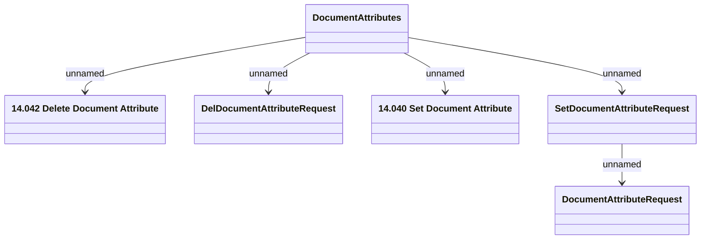

# SetDocumentAttribute

```mermaid
classDiagram
    class n_14_042_Delete_Document_Attribute["14.042 Delete Document Attribute"]
    class DelDocumentAttributeRequest["DelDocumentAttributeRequest"]
    class DocumentAttributeRequest["DocumentAttributeRequest"]
    class n_14_040_Set_Document_Attribute["14.040 Set Document Attribute"]
    class SetDocumentAttributeRequest["SetDocumentAttributeRequest"]
    class DocumentAttributes["DocumentAttributes"]
    DocumentAttributes --> SetDocumentAttributeRequest : unnamed
    DocumentAttributes --> DelDocumentAttributeRequest : unnamed
    DocumentAttributes --> n_14_042_Delete_Document_Attribute : unnamed
    DocumentAttributes --> n_14_040_Set_Document_Attribute : unnamed
    SetDocumentAttributeRequest --> DocumentAttributeRequest : unnamed
```
