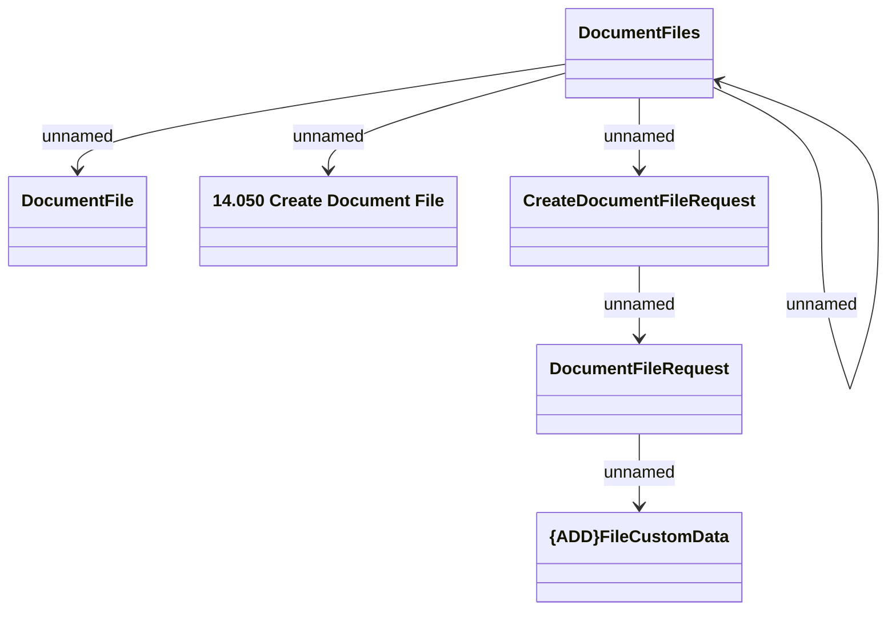

# CreateDocumentFile

```mermaid
classDiagram
    class ADD_FileCustomData["{ADD}FileCustomData"]
    class DocumentFile["DocumentFile"]
    class DocumentFiles["DocumentFiles"]
    class n_14_050_Create_Document_File["14.050 Create Document File"]
    class CreateDocumentFileRequest["CreateDocumentFileRequest"]
    class DocumentFileRequest["DocumentFileRequest"]
    class DocumentFiles["DocumentFiles"]
    DocumentFiles --> n_14_050_Create_Document_File : unnamed
    DocumentFiles --> DocumentFiles : unnamed
    DocumentFiles --> CreateDocumentFileRequest : unnamed
    DocumentFileRequest --> ADD_FileCustomData : unnamed
    CreateDocumentFileRequest --> DocumentFileRequest : unnamed
    DocumentFiles --> DocumentFile : unnamed
```
