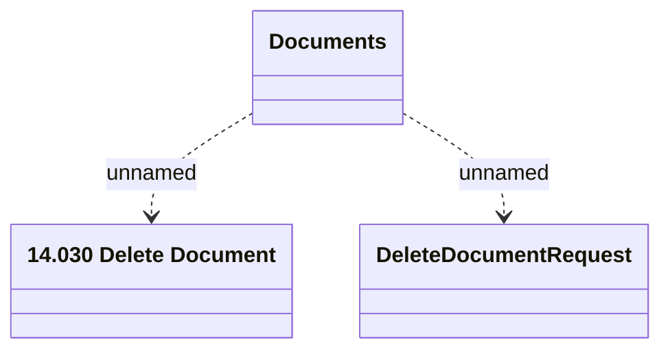

# DeleteDocument

- **Diagram Type**: Logical
- **Package**: HomerSelect/BSL/Modules/Document management (DMS_NG)/Interface Provided/Web Service/Document Instance Services/Documents_v2
- **Diagram ID**: 162109
- **Elements**: 3
- **Connectors**: 2

