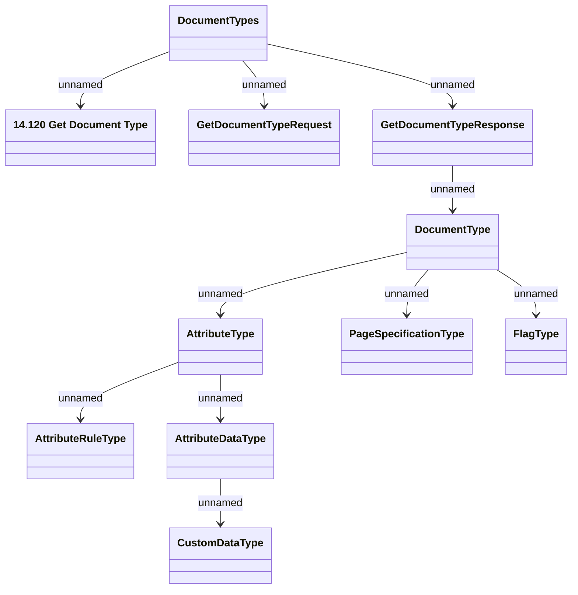

# Document Type Services - Interface Model

```mermaid
classDiagram
    class n_14_120_Get_Document_Type["14.120 Get Document Type"]
    class AttributeRuleType["AttributeRuleType"]
    class CustomDataType["CustomDataType"]
    class AttributeDataType["AttributeDataType"]
    class AttributeType["AttributeType"]
    class PageSpecificationType["PageSpecificationType"]
    class FlagType["FlagType"]
    class DocumentType["DocumentType"]
    class GetDocumentTypeRequest["GetDocumentTypeRequest"]
    class GetDocumentTypeResponse["GetDocumentTypeResponse"]
    class DocumentTypes["DocumentTypes"]
    DocumentTypes --> n_14_120_Get_Document_Type : unnamed
    DocumentTypes --> GetDocumentTypeRequest : unnamed
    DocumentTypes --> GetDocumentTypeResponse : unnamed
    GetDocumentTypeResponse --> DocumentType : unnamed
    DocumentType --> FlagType : unnamed
    DocumentType --> PageSpecificationType : unnamed
    DocumentType --> AttributeType : unnamed
    AttributeType --> AttributeDataType : unnamed
    AttributeType --> AttributeRuleType : unnamed
    AttributeDataType --> CustomDataType : unnamed
```
