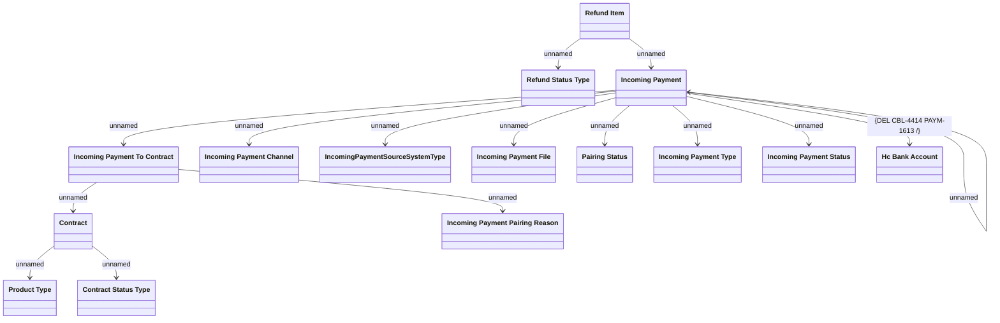

# Incoming payments

```mermaid
classDiagram
    class Refund_Status_Type["Refund Status Type"]
    class Refund_Item["Refund Item"]
    class Product_Type["Product Type"]
    class Contract_Status_Type["Contract Status Type"]
    class Contract["Contract"]
    class Incoming_Payment_To_Contract["Incoming Payment To Contract"]
    class Incoming_Payment_Pairing_Reason["Incoming Payment Pairing Reason "]
    class Incoming_Payment_Channel["Incoming Payment Channel"]
    class IncomingPaymentSourceSystemType["IncomingPaymentSourceSystemType"]
    class Incoming_Payment_File["Incoming Payment File"]
    class Pairing_Status["Pairing Status"]
    class Incoming_Payment_Type["Incoming Payment Type"]
    class Incoming_Payment_Status["Incoming Payment Status"]
    class Hc_Bank_Account["Hc Bank Account"]
    class Incoming_Payment["Incoming Payment"]
    Incoming_Payment --> Incoming_Payment_File : unnamed
    Contract --> Product_Type : unnamed
    Contract --> Contract_Status_Type : unnamed
    Incoming_Payment_To_Contract --> Contract : unnamed
    Incoming_Payment --> Incoming_Payment_To_Contract : unnamed
    Incoming_Payment_To_Contract --> Incoming_Payment_Pairing_Reason : unnamed
    Refund_Item --> Refund_Status_Type : unnamed
    Incoming_Payment --> IncomingPaymentSourceSystemType : unnamed
    Refund_Item --> Incoming_Payment : unnamed
    Incoming_Payment --> Pairing_Status : unnamed
    Incoming_Payment --> Incoming_Payment_Type : unnamed
    Incoming_Payment --> Incoming_Payment_Status : unnamed
    Incoming_Payment --> Hc_Bank_Account : {DEL CBL-4414 PAYM-1613 /}
    Incoming_Payment --> Incoming_Payment : unnamed
    Incoming_Payment --> Incoming_Payment : unnamed
    Incoming_Payment --> Incoming_Payment_Channel : unnamed
```
