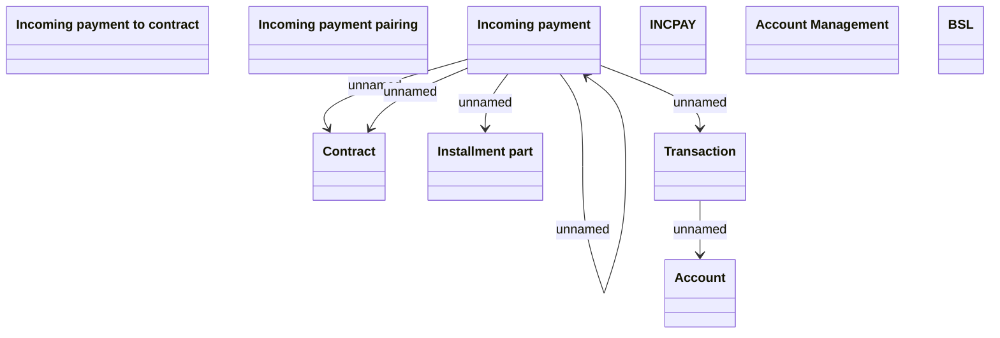

# Database relations - INCPAY, BSL, AM

```mermaid
classDiagram
    class Account["Account"]
    class Incoming_payment_to_contract["Incoming payment to contract"]
    class Contract["Contract"]
    class Incoming_payment_pairing["Incoming payment pairing"]
    class Installment_part["Installment part"]
    class Contract["Contract"]
    class Incoming_payment["Incoming payment"]
    class Transaction["Transaction"]
    class Incoming_payment["Incoming payment"]
    class INCPAY["INCPAY"]
    class Account_Management["Account Management"]
    class BSL["BSL"]
    Transaction --> Account : unnamed
    Incoming_payment --> Contract : unnamed
    Incoming_payment --> Installment_part : unnamed
    Incoming_payment --> Contract : unnamed
    Incoming_payment --> Incoming_payment : unnamed
    Incoming_payment --> Transaction : unnamed
```
