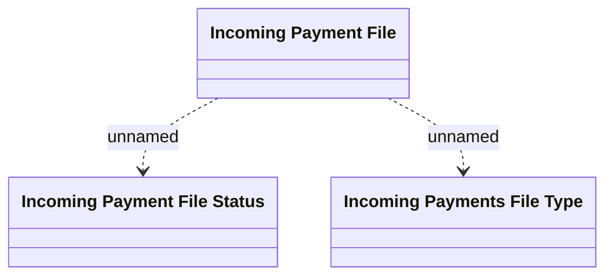

# Import incoming payments file domain model

- **Diagram Type**: Logical
- **Package**: HomerSelect/BSL/Modules/Incoming Payments/Analytical Model/Import incoming payments/Logical Data Model
- **Diagram ID**: 143100
- **Elements**: 3
- **Connectors**: 2

