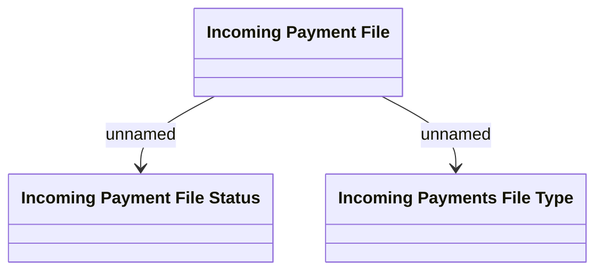

# Import incoming payments file domain model

```mermaid
classDiagram
    class Incoming_Payment_File_Status["Incoming Payment File Status"]
    class Incoming_Payments_File_Type["Incoming Payments File Type"]
    class Incoming_Payment_File["Incoming Payment File"]
    Incoming_Payment_File --> Incoming_Payment_File_Status : unnamed
    Incoming_Payment_File --> Incoming_Payments_File_Type : unnamed
```
