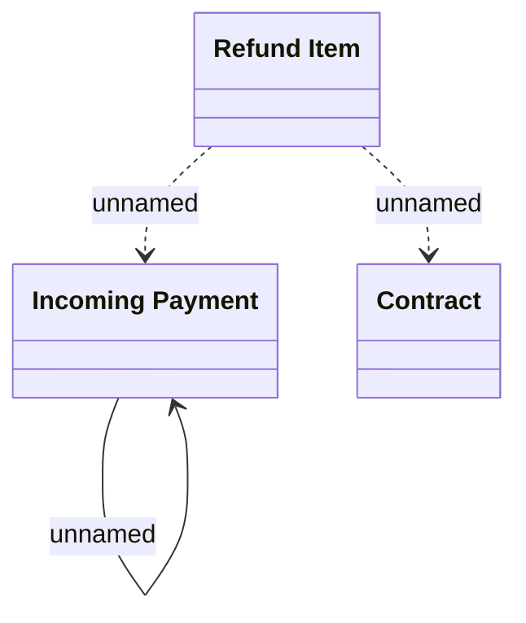

# INCPAY Refunds domain model

- **Diagram Type**: Logical
- **Package**: HomerSelect/BSL/Modules/Incoming Payments/Analytical Model/Refunds/Logical Data Model
- **Diagram ID**: 164302
- **Elements**: 3
- **Connectors**: 4

