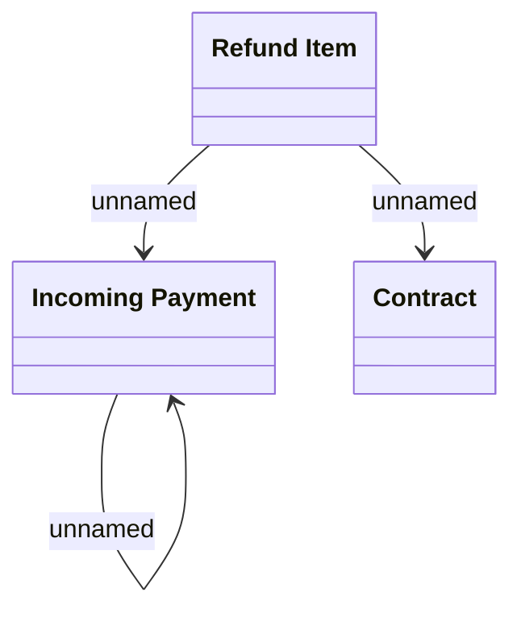

# INCPAY Refunds domain model

```mermaid
classDiagram
    class Incoming_Payment["Incoming Payment"]
    class Contract["Contract"]
    class Refund_Item["Refund Item"]
    Refund_Item --> Incoming_Payment : unnamed
    Refund_Item --> Contract : unnamed
    Incoming_Payment --> Incoming_Payment : unnamed
    Incoming_Payment --> Incoming_Payment : unnamed
```
