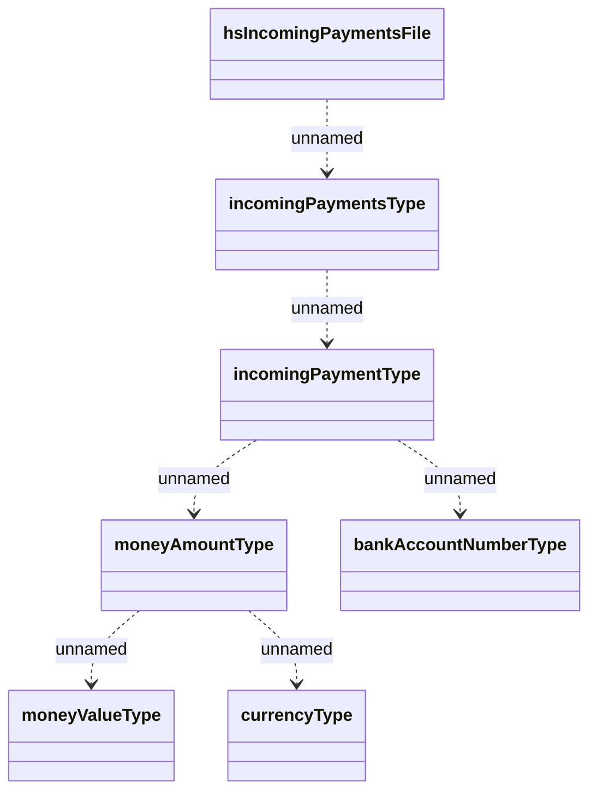

# IncomingPayments file structure

- **Diagram Type**: Logical
- **Package**: HomerSelect/BSL/Modules/Incoming Payments/Interface provided/Consumed File Structures/IncomingPaymentsFile
- **Diagram ID**: 137897
- **Elements**: 7
- **Connectors**: 6

