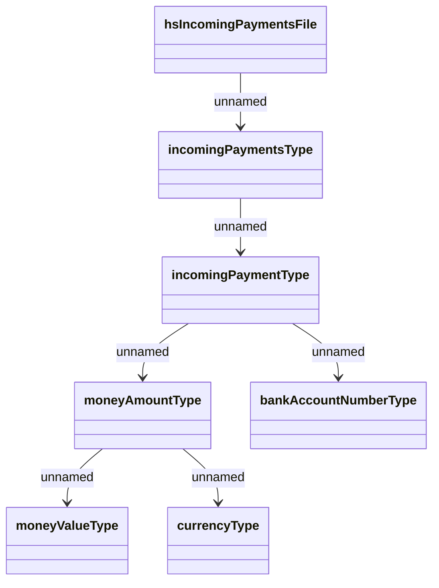

# IncomingPayments file structure

```mermaid
classDiagram
    class currencyType["currencyType"]
    class moneyValueType["moneyValueType"]
    class moneyAmountType["moneyAmountType"]
    class bankAccountNumberType["bankAccountNumberType"]
    class incomingPaymentType["incomingPaymentType"]
    class incomingPaymentsType["incomingPaymentsType"]
    class hsIncomingPaymentsFile["hsIncomingPaymentsFile"]
    hsIncomingPaymentsFile --> incomingPaymentsType : unnamed
    incomingPaymentsType --> incomingPaymentType : unnamed
    incomingPaymentType --> bankAccountNumberType : unnamed
    incomingPaymentType --> moneyAmountType : unnamed
    moneyAmountType --> moneyValueType : unnamed
    moneyAmountType --> currencyType : unnamed
```
