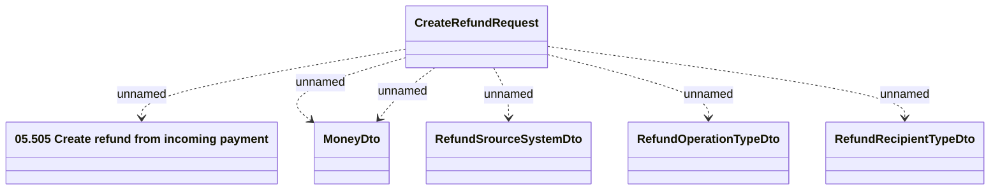

# Create Refund Request

- **Diagram Type**: Logical
- **Package**: HomerSelect/BSL/Modules/Incoming Payments/Interface provided/Generated RMQ messages
- **Diagram ID**: 164605
- **Elements**: 6
- **Connectors**: 6

