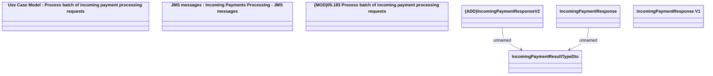

# IncomingPaymentResponseV2

```mermaid
classDiagram
    class Use_Case_Model_Process_batch_of_incoming_payment_processing_["Use Case Model : Process batch of incoming payment processing requests"]
    class JMS_messages_Incoming_Payments_Processing_JMS_messages["JMS messages : Incoming Payments Processing - JMS messages"]
    class MOD_05_183_Process_batch_of_incoming_payment_processing_requ["{MOD}05.183 Process batch of incoming payment processing requests"]
    class IncomingPaymentResultTypeDto["IncomingPaymentResultTypeDto"]
    class IncomingPaymentResponse["IncomingPaymentResponse"]
    class ADD_IncomingPaymentResponseV2["{ADD}IncomingPaymentResponseV2"]
    class IncomingPaymentResponse_V1["IncomingPaymentResponse V1"]
    ADD_IncomingPaymentResponseV2 --> IncomingPaymentResultTypeDto : unnamed
    IncomingPaymentResponse --> IncomingPaymentResultTypeDto : unnamed
```
