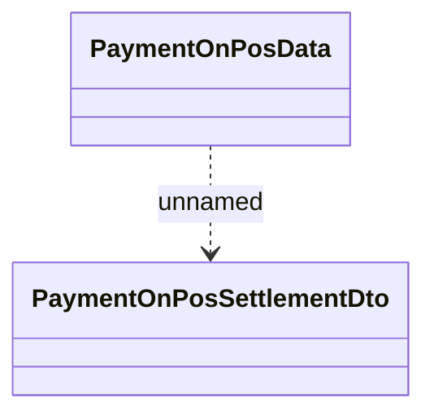

# HO_PAYMENT_ON_POS_DATA data source for print

- **Diagram Type**: Logical
- **Package**: HomerSelect/BSL/Modules/Incoming Payments/Interface provided/Provided Data Sources/HO_PAYMENT_ON_POS_DATA
- **Diagram ID**: 81664
- **Elements**: 2
- **Connectors**: 1

