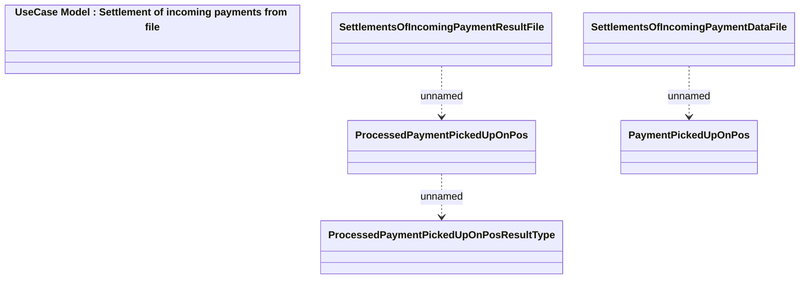

# Settlements of incoming payment file structure

- **Diagram Type**: Logical
- **Package**: HomerSelect/BSL/Modules/Incoming Payments/Interface provided/Provided File Structures/Settlements of incoming payment file structure
- **Diagram ID**: 81661
- **Elements**: 6
- **Connectors**: 3

