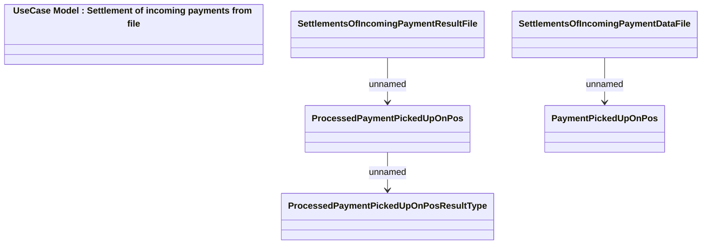

# Settlements of incoming payment file structure

```mermaid
classDiagram
    class UseCase_Model_Settlement_of_incoming_payments_from_file["UseCase Model : Settlement of incoming payments from file"]
    class ProcessedPaymentPickedUpOnPosResultType["ProcessedPaymentPickedUpOnPosResultType"]
    class ProcessedPaymentPickedUpOnPos["ProcessedPaymentPickedUpOnPos"]
    class SettlementsOfIncomingPaymentResultFile["SettlementsOfIncomingPaymentResultFile"]
    class PaymentPickedUpOnPos["PaymentPickedUpOnPos"]
    class SettlementsOfIncomingPaymentDataFile["SettlementsOfIncomingPaymentDataFile"]
    ProcessedPaymentPickedUpOnPos --> ProcessedPaymentPickedUpOnPosResultType : unnamed
    SettlementsOfIncomingPaymentResultFile --> ProcessedPaymentPickedUpOnPos : unnamed
    SettlementsOfIncomingPaymentDataFile --> PaymentPickedUpOnPos : unnamed
```
