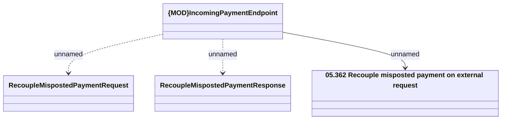

# IncominPaymentEndpoint - RecouleMispostedPayment

- **Diagram Type**: Logical
- **Package**: HomerSelect/BSL/Modules/Incoming Payments/Interface provided/Provided REST API/IncomingPaymentEndpoint
- **Diagram ID**: 164103
- **Elements**: 4
- **Connectors**: 3

