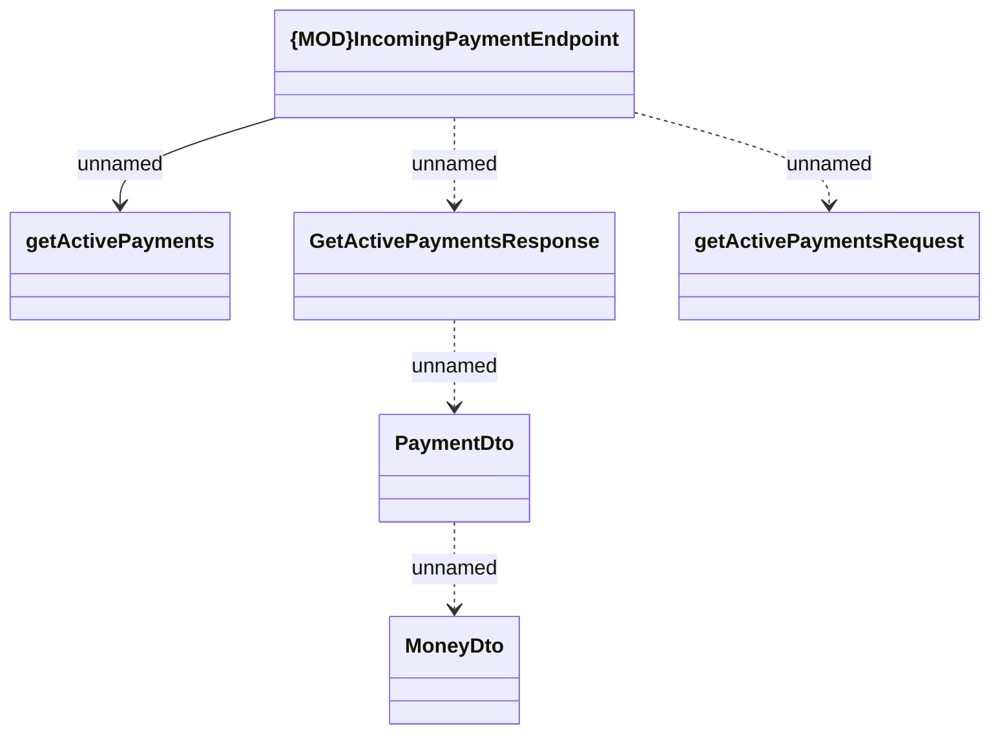

# IncomingPaymentEndpoint - GetActivePayments

- **Diagram Type**: Logical
- **Package**: HomerSelect/BSL/Modules/Incoming Payments/Interface provided/Provided REST API/IncomingPaymentEndpoint
- **Diagram ID**: 164104
- **Elements**: 6
- **Connectors**: 5

