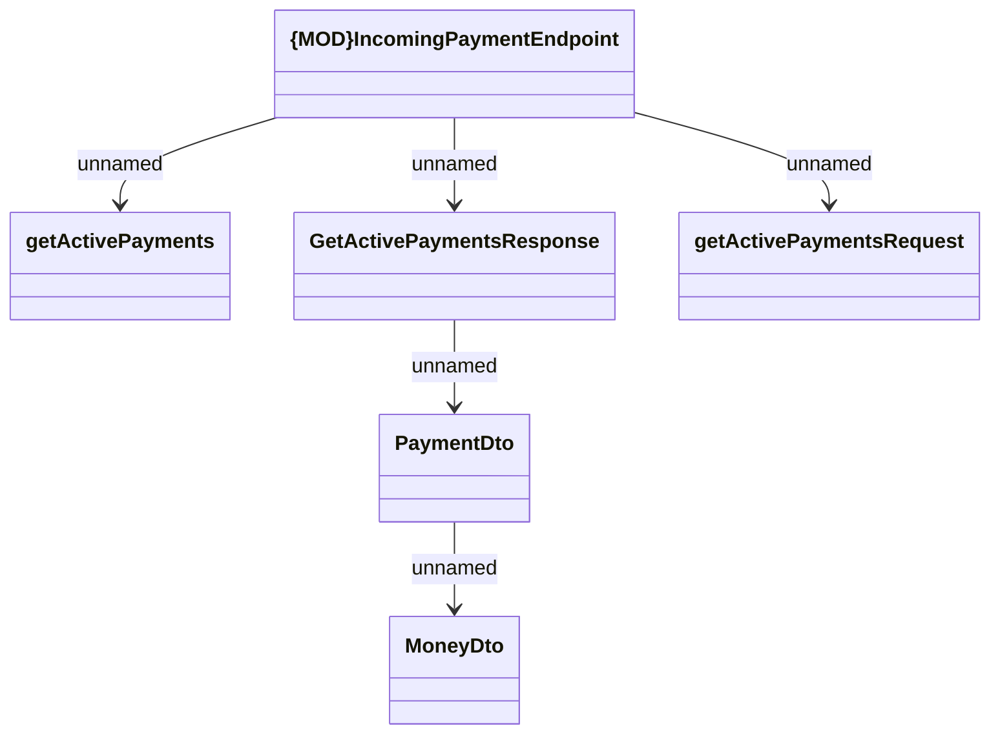

# IncomingPaymentEndpoint - GetActivePayments

```mermaid
classDiagram
    class getActivePayments["getActivePayments"]
    class GetActivePaymentsResponse["GetActivePaymentsResponse"]
    class MoneyDto["MoneyDto"]
    class PaymentDto["PaymentDto"]
    class getActivePaymentsRequest["getActivePaymentsRequest"]
    class MOD_IncomingPaymentEndpoint["{MOD}IncomingPaymentEndpoint"]
    MOD_IncomingPaymentEndpoint --> getActivePaymentsRequest : unnamed
    GetActivePaymentsResponse --> PaymentDto : unnamed
    PaymentDto --> MoneyDto : unnamed
    MOD_IncomingPaymentEndpoint --> GetActivePaymentsResponse : unnamed
    MOD_IncomingPaymentEndpoint --> getActivePayments : unnamed
```
