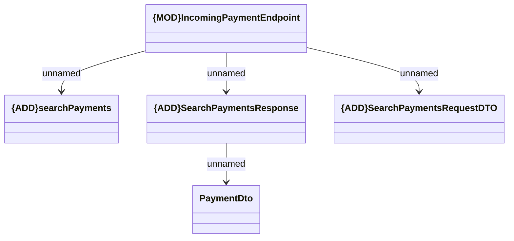

# IncomingPaymentEndpoint - SearchPayments

```mermaid
classDiagram
    class ADD_searchPayments["{ADD}searchPayments"]
    class PaymentDto["PaymentDto"]
    class ADD_SearchPaymentsResponse["{ADD}SearchPaymentsResponse"]
    class ADD_SearchPaymentsRequestDTO["{ADD}SearchPaymentsRequestDTO"]
    class MOD_IncomingPaymentEndpoint["{MOD}IncomingPaymentEndpoint"]
    MOD_IncomingPaymentEndpoint --> ADD_SearchPaymentsRequestDTO : unnamed
    MOD_IncomingPaymentEndpoint --> ADD_SearchPaymentsResponse : unnamed
    ADD_SearchPaymentsResponse --> PaymentDto : unnamed
    MOD_IncomingPaymentEndpoint --> ADD_searchPayments : unnamed
```
