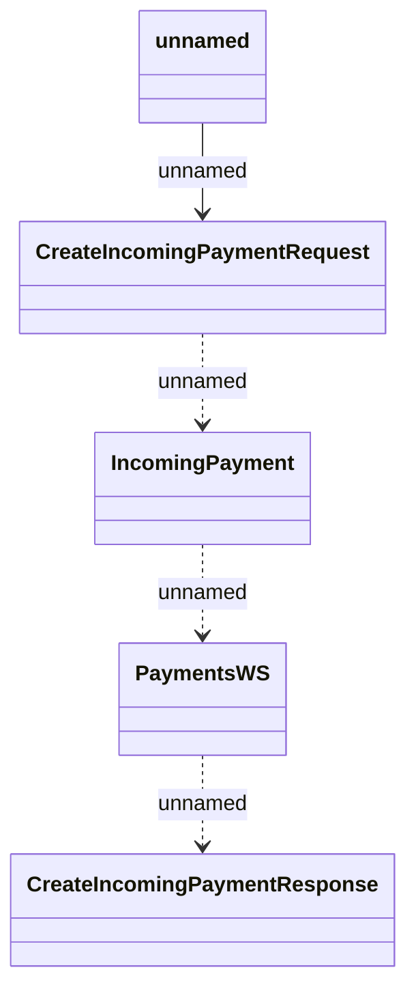

# PaymentsWS REST

- **Diagram Type**: Logical
- **Package**: HomerSelect/BSL/Modules/Incoming Payments/Interface provided/Provided REST API/PaymentsWS REST
- **Diagram ID**: 163116
- **Elements**: 5
- **Connectors**: 4

