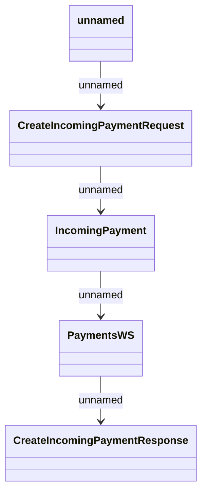

# PaymentsWS REST

```mermaid
classDiagram
    class CreateIncomingPaymentResponse["CreateIncomingPaymentResponse"]
    class IncomingPayment["IncomingPayment"]
    class CreateIncomingPaymentRequest["CreateIncomingPaymentRequest"]
    class PaymentsWS["PaymentsWS"]
    PaymentsWS --> CreateIncomingPaymentResponse : unnamed
    CreateIncomingPaymentRequest --> IncomingPayment : unnamed
    IncomingPayment --> PaymentsWS : unnamed
    unnamed --> CreateIncomingPaymentRequest : unnamed
```
