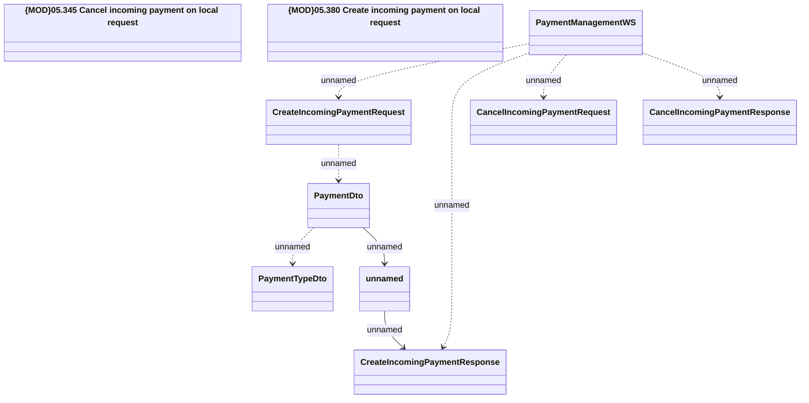

# Incoming Payments Module - PaymentManagementWS (for local systems)

- **Diagram Type**: Logical
- **Package**: HomerSelect/BSL/Modules/Incoming Payments/Interface provided/Provided WS/PaymentManagementWS (INCPAY)
- **Diagram ID**: 140189
- **Elements**: 10
- **Connectors**: 8

