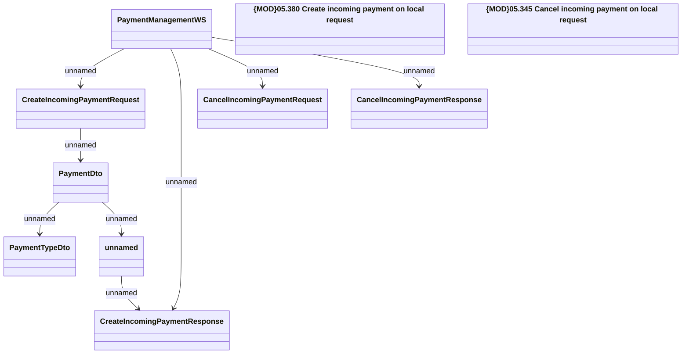

# Incoming Payments Module - PaymentManagementWS (for local systems)

```mermaid
classDiagram
    class PaymentDto["PaymentDto"]
    class PaymentTypeDto["PaymentTypeDto"]
    class CancelIncomingPaymentResponse["CancelIncomingPaymentResponse"]
    class CancelIncomingPaymentRequest["CancelIncomingPaymentRequest"]
    class CreateIncomingPaymentResponse["CreateIncomingPaymentResponse"]
    class CreateIncomingPaymentRequest["CreateIncomingPaymentRequest"]
    class PaymentManagementWS["PaymentManagementWS"]
    class MOD_05_380_Create_incoming_payment_on_local_request["{MOD}05.380 Create incoming payment on local request"]
    class MOD_05_345_Cancel_incoming_payment_on_local_request["{MOD}05.345 Cancel incoming payment on local request"]
    PaymentManagementWS --> CreateIncomingPaymentRequest : unnamed
    PaymentManagementWS --> CreateIncomingPaymentResponse : unnamed
    unnamed --> CreateIncomingPaymentResponse : unnamed
    PaymentManagementWS --> CancelIncomingPaymentRequest : unnamed
    PaymentManagementWS --> CancelIncomingPaymentResponse : unnamed
    PaymentDto --> PaymentTypeDto : unnamed
    PaymentDto --> unnamed : unnamed
    CreateIncomingPaymentRequest --> PaymentDto : unnamed
```
