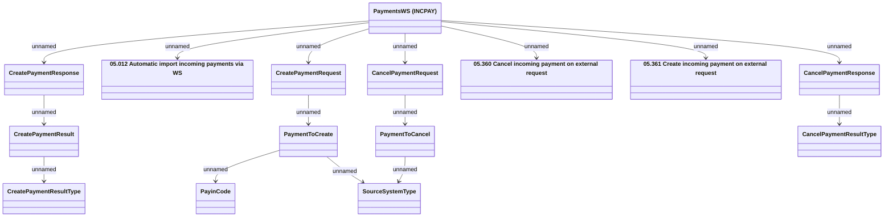

# PaymentsWS (for external systems)

```mermaid
classDiagram
    class n_05_012_Automatic_import_incoming_payments_via_WS["05.012 Automatic import incoming payments via WS"]
    class n_05_361_Create_incoming_payment_on_external_request["05.361 Create incoming payment on external request"]
    class n_05_360_Cancel_incoming_payment_on_external_request["05.360 Cancel incoming payment on external request"]
    class CreatePaymentResultType["CreatePaymentResultType"]
    class PayinCode["PayinCode"]
    class CreatePaymentResult["CreatePaymentResult"]
    class PaymentToCreate["PaymentToCreate"]
    class CreatePaymentResponse["CreatePaymentResponse"]
    class CreatePaymentRequest["CreatePaymentRequest"]
    class SourceSystemType["SourceSystemType"]
    class CancelPaymentResultType["CancelPaymentResultType"]
    class CancelPaymentResponse["CancelPaymentResponse"]
    class PaymentToCancel["PaymentToCancel"]
    class CancelPaymentRequest["CancelPaymentRequest"]
    class PaymentsWS_INCPAY["PaymentsWS (INCPAY)"]
    PaymentsWS_INCPAY --> CreatePaymentResponse : unnamed
    PaymentsWS_INCPAY --> n_05_012_Automatic_import_incoming_payments_via_WS : unnamed
    PaymentsWS_INCPAY --> CreatePaymentRequest : unnamed
    PaymentsWS_INCPAY --> CancelPaymentRequest : unnamed
    PaymentsWS_INCPAY --> n_05_360_Cancel_incoming_payment_on_external_request : unnamed
    PaymentsWS_INCPAY --> n_05_361_Create_incoming_payment_on_external_request : unnamed
    PaymentsWS_INCPAY --> CancelPaymentResponse : unnamed
    CancelPaymentRequest --> PaymentToCancel : unnamed
    PaymentToCancel --> SourceSystemType : unnamed
    CancelPaymentResponse --> CancelPaymentResultType : unnamed
    CreatePaymentRequest --> PaymentToCreate : unnamed
    CreatePaymentResponse --> CreatePaymentResult : unnamed
    PaymentToCreate --> PayinCode : unnamed
    PaymentToCreate --> SourceSystemType : unnamed
    CreatePaymentResult --> CreatePaymentResultType : unnamed
```
