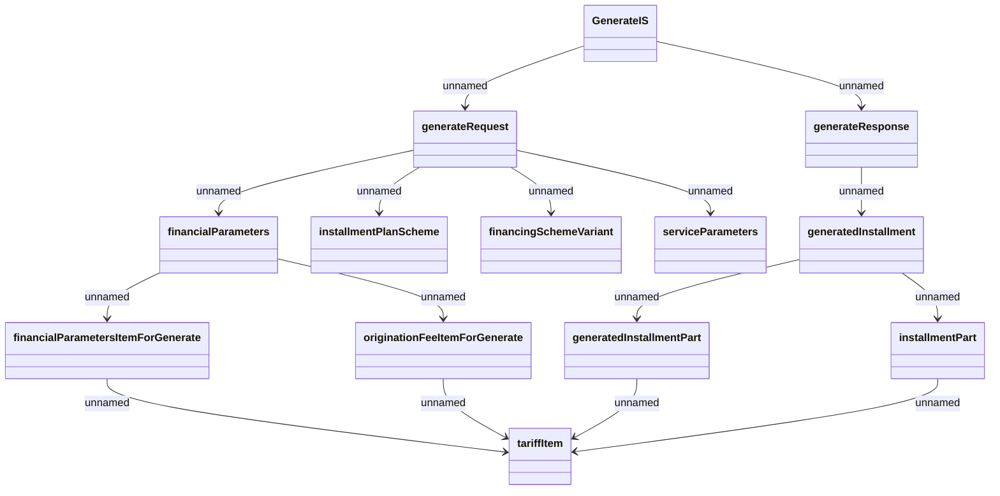

# GenerateIS

```mermaid
classDiagram
    class serviceParameters["serviceParameters"]
    class installmentPart["installmentPart"]
    class generatedInstallmentPart["generatedInstallmentPart"]
    class generatedInstallment["generatedInstallment"]
    class tariffItem["tariffItem"]
    class originationFeeItemForGenerate["originationFeeItemForGenerate"]
    class financialParametersItemForGenerate["financialParametersItemForGenerate"]
    class financingSchemeVariant["financingSchemeVariant"]
    class installmentPlanScheme["installmentPlanScheme"]
    class financialParameters["financialParameters"]
    class generateResponse["generateResponse"]
    class GenerateIS["GenerateIS"]
    class generateRequest["generateRequest"]
    GenerateIS --> generateRequest : unnamed
    GenerateIS --> generateResponse : unnamed
    generateRequest --> financialParameters : unnamed
    generateRequest --> installmentPlanScheme : unnamed
    generateRequest --> financingSchemeVariant : unnamed
    financialParameters --> financialParametersItemForGenerate : unnamed
    financialParameters --> originationFeeItemForGenerate : unnamed
    installmentPart --> tariffItem : unnamed
    generatedInstallmentPart --> tariffItem : unnamed
    originationFeeItemForGenerate --> tariffItem : unnamed
    financialParametersItemForGenerate --> tariffItem : unnamed
    generateResponse --> generatedInstallment : unnamed
    generatedInstallment --> generatedInstallmentPart : unnamed
    generatedInstallment --> installmentPart : unnamed
    generateRequest --> serviceParameters : unnamed
```
