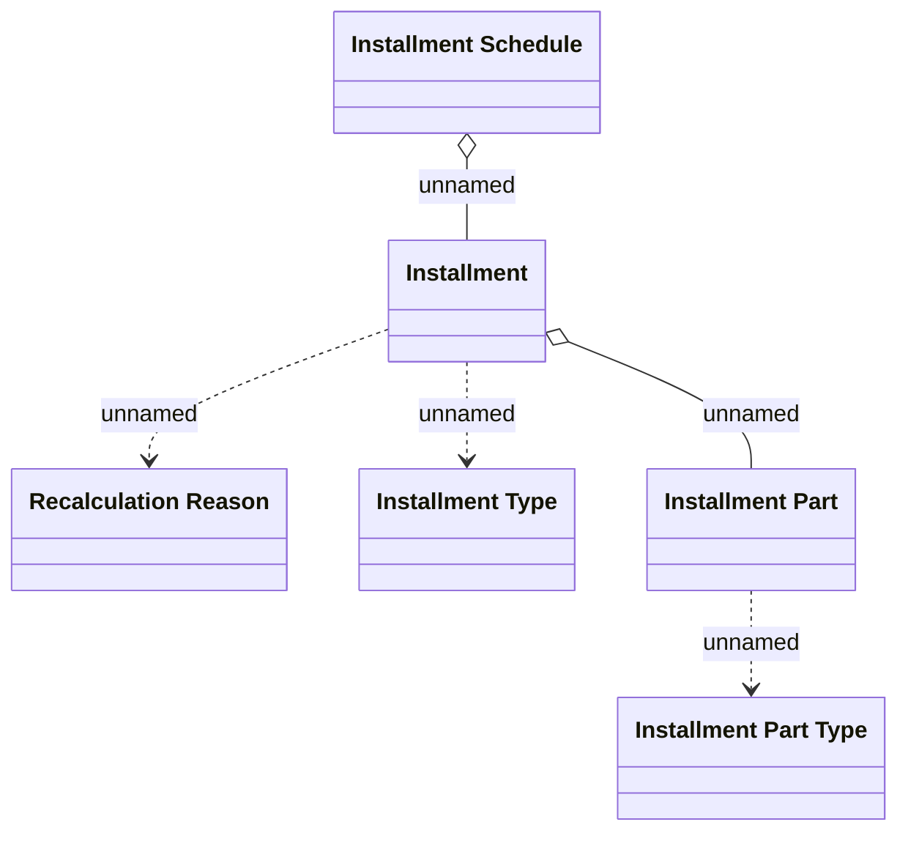

# Installment schedule

- **Diagram Type**: Logical
- **Package**: HomerSelect/BSL/Modules/Installment schedule management/Analytical Model/Logical Data Model
- **Diagram ID**: 149261
- **Elements**: 6
- **Connectors**: 5

