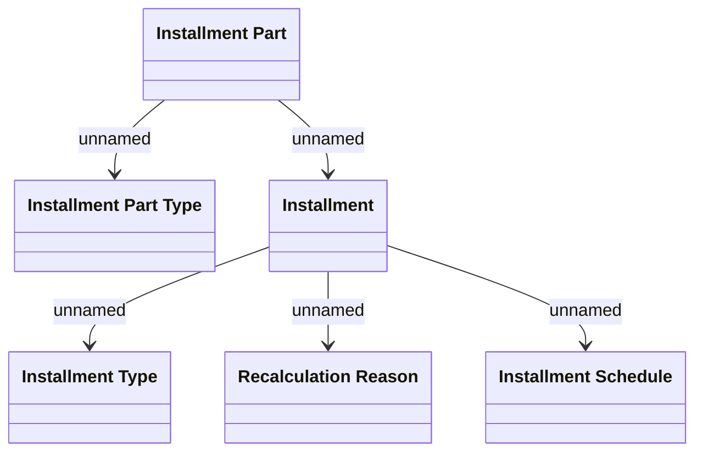

# Installment schedule

```mermaid
classDiagram
    class Installment_Schedule["Installment Schedule"]
    class Installment_Part_Type["Installment Part Type"]
    class Recalculation_Reason["Recalculation Reason"]
    class Installment_Type["Installment Type"]
    class Installment_Part["Installment Part"]
    class Installment["Installment"]
    Installment_Part --> Installment : unnamed
    Installment --> Installment_Type : unnamed
    Installment --> Recalculation_Reason : unnamed
    Installment_Part --> Installment_Part_Type : unnamed
    Installment --> Installment_Schedule : unnamed
```
