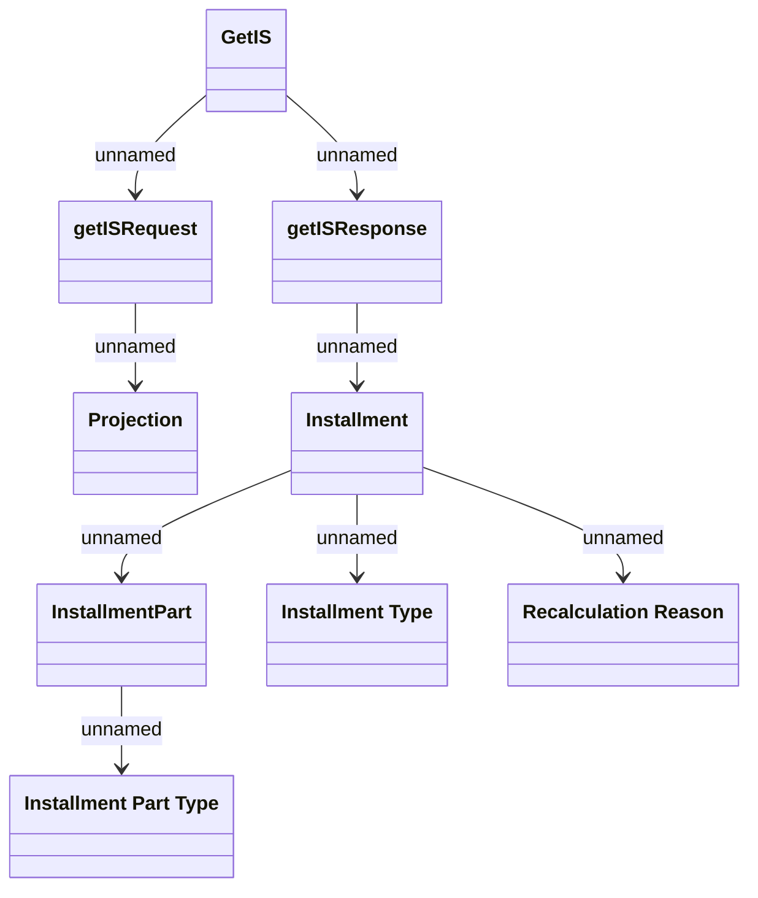

# GetIS

```mermaid
classDiagram
    class Projection["Projection"]
    class Installment_Part_Type["Installment Part Type"]
    class InstallmentPart["InstallmentPart"]
    class Installment_Type["Installment Type"]
    class Recalculation_Reason["Recalculation Reason"]
    class Installment["Installment"]
    class getISRequest["getISRequest"]
    class getISResponse["getISResponse"]
    class GetIS["GetIS"]
    getISRequest --> Projection : unnamed
    GetIS --> getISResponse : unnamed
    GetIS --> getISRequest : unnamed
    getISResponse --> Installment : unnamed
    Installment --> Recalculation_Reason : unnamed
    Installment --> Installment_Type : unnamed
    Installment --> InstallmentPart : unnamed
    InstallmentPart --> Installment_Part_Type : unnamed
```
