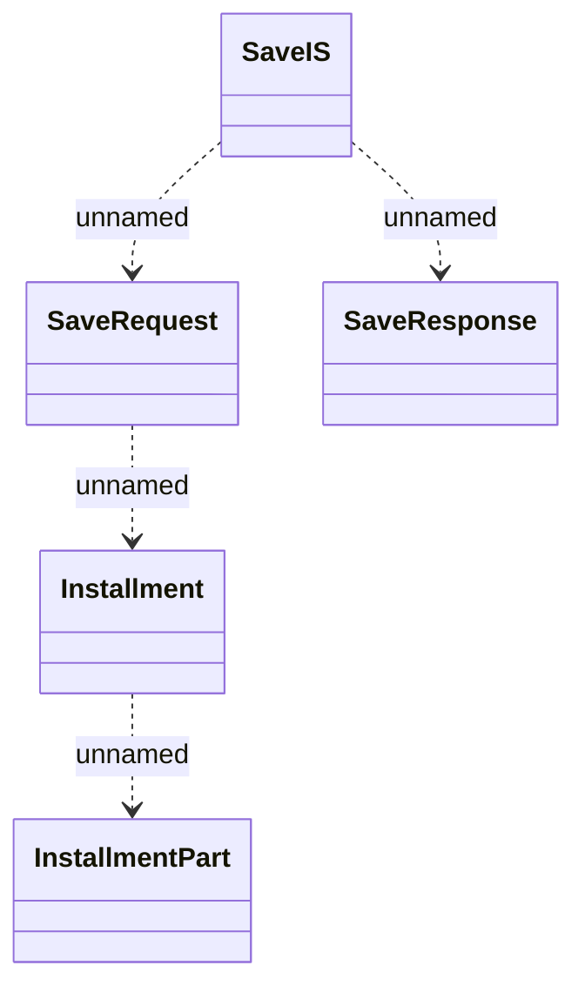

# SaveIS

- **Diagram Type**: Logical
- **Package**: HomerSelect/BSL/Modules/Installment schedule management/Interface Provided/REST
- **Diagram ID**: 149563
- **Elements**: 5
- **Connectors**: 4

```mermaid
classDiagram
    class InstallmentPart["InstallmentPart"]
    class SaveRequest["SaveRequest"]
    class SaveResponse["SaveResponse"]
    class Installment["Installment"]
    class SaveIS["SaveIS"]
    SaveRequest ..> Installment : unnamed
    SaveIS ..> SaveResponse : unnamed
    SaveIS ..> SaveRequest : unnamed
    Installment ..> InstallmentPart : unnamed
```
