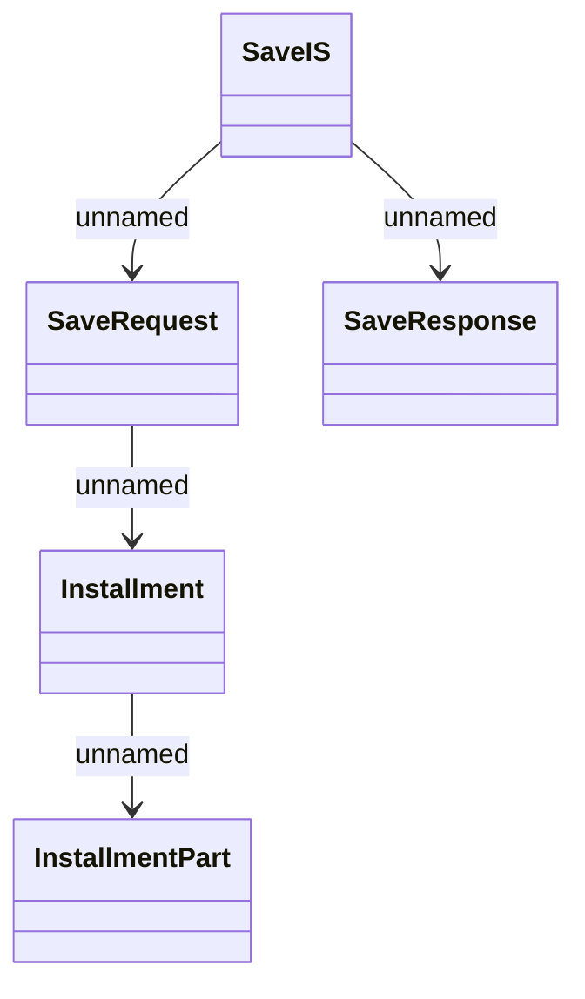

# SaveIS

```mermaid
classDiagram
    class InstallmentPart["InstallmentPart"]
    class SaveRequest["SaveRequest"]
    class SaveResponse["SaveResponse"]
    class Installment["Installment"]
    class SaveIS["SaveIS"]
    SaveRequest --> Installment : unnamed
    SaveIS --> SaveResponse : unnamed
    SaveIS --> SaveRequest : unnamed
    Installment --> InstallmentPart : unnamed
```
