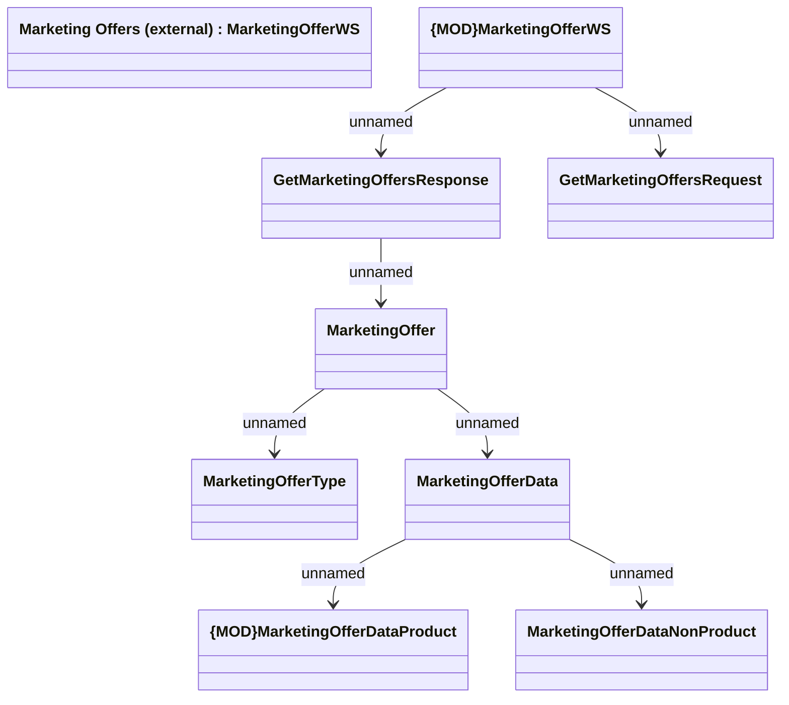

# MarketingOfferWS - GetMarketingOffers

```mermaid
classDiagram
    class MarketingOfferType["MarketingOfferType"]
    class Marketing_Offers_external_MarketingOfferWS["Marketing Offers (external) : MarketingOfferWS"]
    class MarketingOfferDataNonProduct["MarketingOfferDataNonProduct"]
    class MarketingOfferData["MarketingOfferData"]
    class MOD_MarketingOfferDataProduct["{MOD}MarketingOfferDataProduct"]
    class MarketingOffer["MarketingOffer"]
    class GetMarketingOffersResponse["GetMarketingOffersResponse"]
    class MOD_MarketingOfferWS["{MOD}MarketingOfferWS"]
    class GetMarketingOffersRequest["GetMarketingOffersRequest"]
    GetMarketingOffersResponse --> MarketingOffer : unnamed
    MarketingOfferData --> MOD_MarketingOfferDataProduct : unnamed
    MarketingOffer --> MarketingOfferData : unnamed
    MarketingOfferData --> MarketingOfferDataNonProduct : unnamed
    MarketingOffer --> MarketingOfferType : unnamed
    MOD_MarketingOfferWS --> GetMarketingOffersRequest : unnamed
    MOD_MarketingOfferWS --> GetMarketingOffersResponse : unnamed
```
