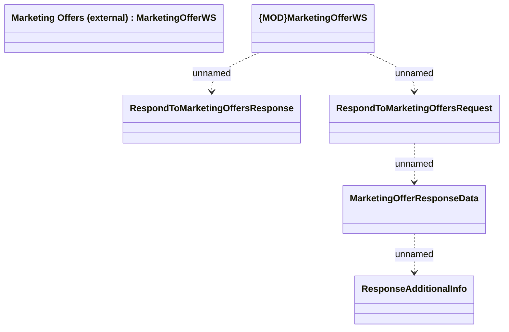

# MarketingOfferWS - RespondToMarketingOffers

- **Diagram Type**: Logical
- **Package**: HomerSelect/BSL/Modules/Marketing Offer/Analytical Model/Marketing Offers Data Source/Marketing Offers (SAS)/Interface Consumed/RespondToMarketingOffers
- **Diagram ID**: 99512
- **Elements**: 6
- **Connectors**: 4

