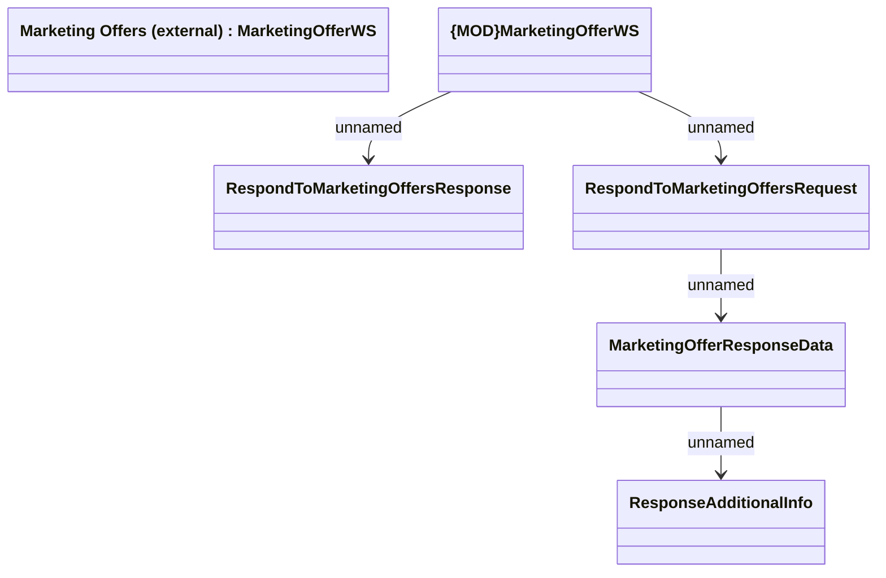

# MarketingOfferWS - RespondToMarketingOffers

```mermaid
classDiagram
    class ResponseAdditionalInfo["ResponseAdditionalInfo"]
    class RespondToMarketingOffersResponse["RespondToMarketingOffersResponse"]
    class MarketingOfferResponseData["MarketingOfferResponseData"]
    class RespondToMarketingOffersRequest["RespondToMarketingOffersRequest"]
    class Marketing_Offers_external_MarketingOfferWS["Marketing Offers (external) : MarketingOfferWS"]
    class MOD_MarketingOfferWS["{MOD}MarketingOfferWS"]
    RespondToMarketingOffersRequest --> MarketingOfferResponseData : unnamed
    MarketingOfferResponseData --> ResponseAdditionalInfo : unnamed
    MOD_MarketingOfferWS --> RespondToMarketingOffersRequest : unnamed
    MOD_MarketingOfferWS --> RespondToMarketingOffersResponse : unnamed
```
