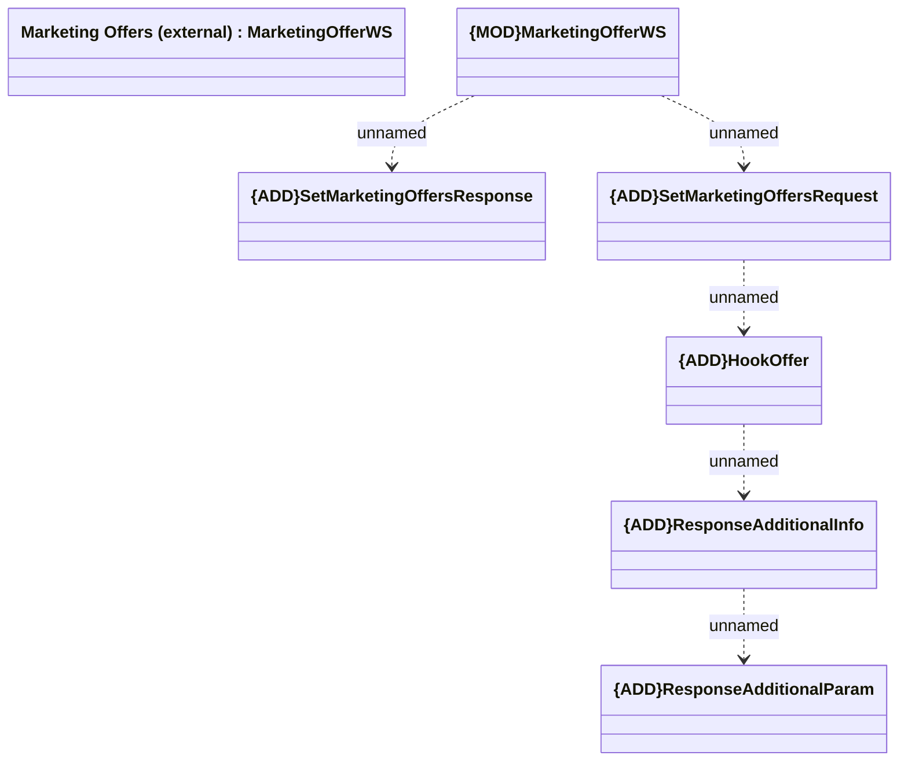

# MarketingOfferWS - SetMarketingOffers

- **Diagram Type**: Logical
- **Package**: HomerSelect/BSL/Modules/Marketing Offer/Analytical Model/Marketing Offers Data Source/Marketing Offers (SAS)/Interface Consumed/SetMarketingOffers
- **Diagram ID**: 101411
- **Elements**: 7
- **Connectors**: 5

