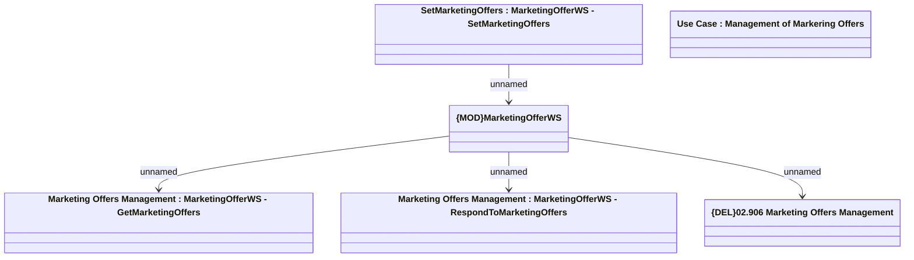

# MarketingOfferWS

```mermaid
classDiagram
    class SetMarketingOffers_MarketingOfferWS_SetMarketingOffers["SetMarketingOffers : MarketingOfferWS - SetMarketingOffers"]
    class Use_Case_Management_of_Markering_Offers["Use Case : Management of Markering Offers"]
    class DEL_02_906_Marketing_Offers_Management["{DEL}02.906 Marketing Offers Management"]
    class Marketing_Offers_Management_MarketingOfferWS_RespondToMarket["Marketing Offers Management : MarketingOfferWS - RespondToMarketingOffers"]
    class Marketing_Offers_Management_MarketingOfferWS_GetMarketingOff["Marketing Offers Management : MarketingOfferWS - GetMarketingOffers"]
    class MOD_MarketingOfferWS["{MOD}MarketingOfferWS"]
    SetMarketingOffers_MarketingOfferWS_SetMarketingOffers --> MOD_MarketingOfferWS : unnamed
    MOD_MarketingOfferWS --> Marketing_Offers_Management_MarketingOfferWS_GetMarketingOff : unnamed
    MOD_MarketingOfferWS --> Marketing_Offers_Management_MarketingOfferWS_RespondToMarket : unnamed
    MOD_MarketingOfferWS --> DEL_02_906_Marketing_Offers_Management : unnamed
```
