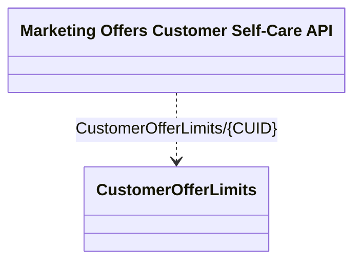

# Application Interface Model

- **Diagram Type**: Logical
- **Package**: HomerSelect/BSL/Modules/Marketing Offer/Analytical Model/Marketing Offers Data Source/Marketing Offers Data Source (common)/Interface Provided/CustomerOfferLimits.GetCustomerOfferLimits (OpenAPI)/Customer Self-Care API
- **Diagram ID**: 89391
- **Elements**: 2
- **Connectors**: 1

