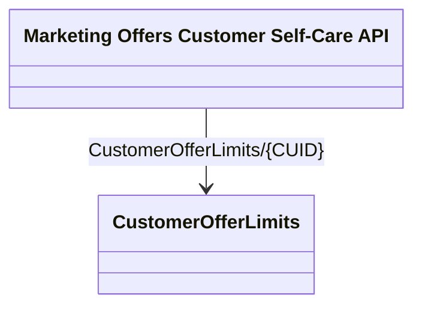

# Application Interface Model

```mermaid
classDiagram
    class Marketing_Offers_Customer_Self_Care_API["Marketing Offers Customer Self-Care API"]
    class CustomerOfferLimits["CustomerOfferLimits"]
    Marketing_Offers_Customer_Self_Care_API --> CustomerOfferLimits : CustomerOfferLimits/{CUID}
```
