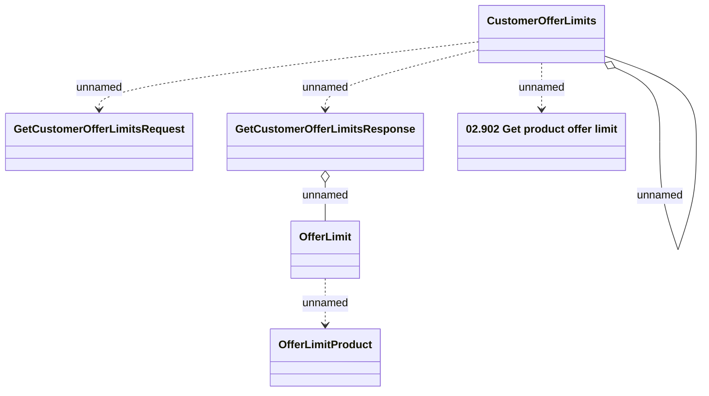

# Customer Offer Limits - GetCustomerOfferLimits (OpenAPI)

- **Diagram Type**: Logical
- **Package**: HomerSelect/BSL/Modules/Marketing Offer/Analytical Model/Marketing Offers Data Source/Marketing Offers Data Source (common)/Interface Provided/CustomerOfferLimits.GetCustomerOfferLimits (OpenAPI)
- **Diagram ID**: 110070
- **Elements**: 7
- **Connectors**: 6

