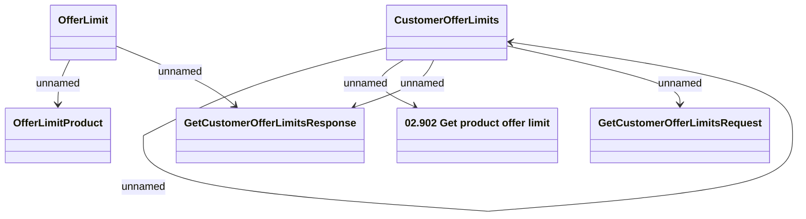

# Customer Offer Limits - GetCustomerOfferLimits (OpenAPI)

```mermaid
classDiagram
    class GetCustomerOfferLimitsRequest["GetCustomerOfferLimitsRequest"]
    class GetCustomerOfferLimitsResponse["GetCustomerOfferLimitsResponse"]
    class CustomerOfferLimits["CustomerOfferLimits"]
    class n_02_902_Get_product_offer_limit["02.902 Get product offer limit"]
    class CustomerOfferLimits["CustomerOfferLimits"]
    class OfferLimitProduct["OfferLimitProduct"]
    class OfferLimit["OfferLimit"]
    OfferLimit --> OfferLimitProduct : unnamed
    CustomerOfferLimits --> CustomerOfferLimits : unnamed
    OfferLimit --> GetCustomerOfferLimitsResponse : unnamed
    CustomerOfferLimits --> n_02_902_Get_product_offer_limit : unnamed
    CustomerOfferLimits --> GetCustomerOfferLimitsResponse : unnamed
    CustomerOfferLimits --> GetCustomerOfferLimitsRequest : unnamed
```
