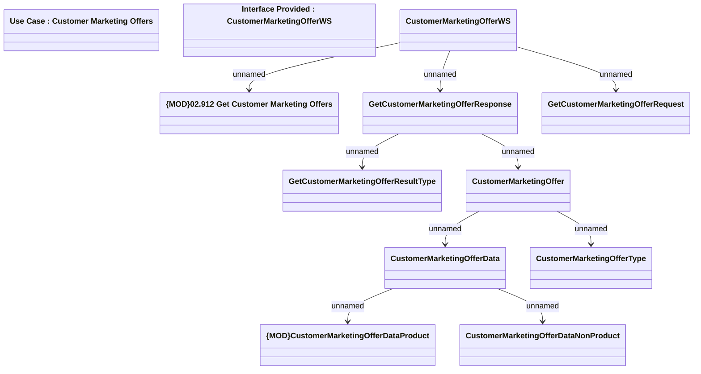

# CustomerMarketingOfferWS - GetCustomerMarketingOffer

```mermaid
classDiagram
    class Use_Case_Customer_Marketing_Offers["Use Case : Customer Marketing Offers"]
    class MOD_02_912_Get_Customer_Marketing_Offers["{MOD}02.912 Get Customer Marketing Offers"]
    class GetCustomerMarketingOfferResultType["GetCustomerMarketingOfferResultType"]
    class CustomerMarketingOfferDataNonProduct["CustomerMarketingOfferDataNonProduct"]
    class CustomerMarketingOfferData["CustomerMarketingOfferData"]
    class MOD_CustomerMarketingOfferDataProduct["{MOD}CustomerMarketingOfferDataProduct"]
    class CustomerMarketingOfferType["CustomerMarketingOfferType"]
    class CustomerMarketingOffer["CustomerMarketingOffer"]
    class GetCustomerMarketingOfferResponse["GetCustomerMarketingOfferResponse"]
    class GetCustomerMarketingOfferRequest["GetCustomerMarketingOfferRequest"]
    class Interface_Provided_CustomerMarketingOfferWS["Interface Provided : CustomerMarketingOfferWS"]
    class CustomerMarketingOfferWS["CustomerMarketingOfferWS"]
    CustomerMarketingOfferWS --> GetCustomerMarketingOfferRequest : unnamed
    CustomerMarketingOfferWS --> GetCustomerMarketingOfferResponse : unnamed
    GetCustomerMarketingOfferResponse --> CustomerMarketingOffer : unnamed
    CustomerMarketingOffer --> CustomerMarketingOfferType : unnamed
    CustomerMarketingOfferData --> MOD_CustomerMarketingOfferDataProduct : unnamed
    CustomerMarketingOffer --> CustomerMarketingOfferData : unnamed
    CustomerMarketingOfferData --> CustomerMarketingOfferDataNonProduct : unnamed
    GetCustomerMarketingOfferResponse --> GetCustomerMarketingOfferResultType : unnamed
    CustomerMarketingOfferWS --> MOD_02_912_Get_Customer_Marketing_Offers : unnamed
```
