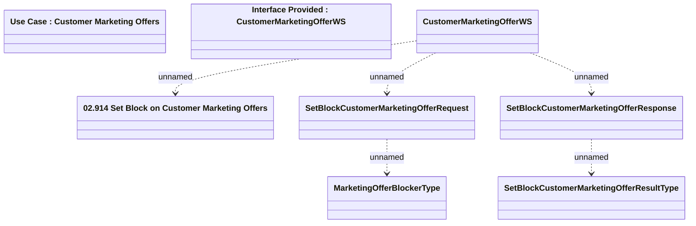

# CustomerMarketingOfferWS - SetBlockCustomerMarketingOffer

- **Diagram Type**: Logical
- **Package**: HomerSelect/BSL/Modules/Marketing Offer/Analytical Model/Marketing Offers Data Source/Marketing Offers Data Source (common)/Interface Provided/CustomerMarketingOfferWS.Get/SetBlockCustomerMarketingOffer
- **Diagram ID**: 91969
- **Elements**: 8
- **Connectors**: 5

